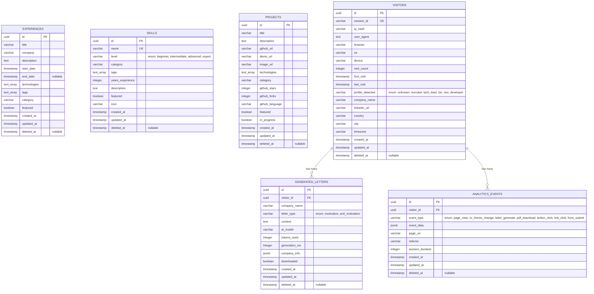

# Entity Relationship Diagram (ERD)

## Database Schema - maicivy

## Relations

### One-to-Many

- **VISITORS → GENERATED_LETTERS**
  - Un visiteur peut générer plusieurs lettres
  - Foreign key: `generated_letters.visitor_id` → `visitors.id`
  - ON DELETE CASCADE

- **VISITORS → ANALYTICS_EVENTS**
  - Un visiteur peut avoir plusieurs événements analytics
  - Foreign key: `analytics_events.visitor_id` → `visitors.id`
  - ON DELETE CASCADE

## Indexes

### EXPERIENCES
- `idx_experiences_category` on `category`
- `idx_experiences_deleted_at` on `deleted_at`

### SKILLS
- `idx_skills_category` on `category`
- `idx_skills_level` on `level`
- `idx_skills_deleted_at` on `deleted_at`
- UNIQUE constraint on `name`

### PROJECTS
- `idx_projects_category` on `category`
- `idx_projects_featured` on `featured`
- `idx_projects_deleted_at` on `deleted_at`

### VISITORS
- `idx_visitors_session_id` on `session_id` (UNIQUE)
- `idx_visitors_ip_hash` on `ip_hash`
- `idx_visitors_profile_detected` on `profile_detected`
- `idx_visitors_deleted_at` on `deleted_at`

### GENERATED_LETTERS
- `idx_generated_letters_visitor_id` on `visitor_id`
- `idx_generated_letters_letter_type` on `letter_type`
- `idx_generated_letters_created_at` on `created_at DESC`
- `idx_generated_letters_deleted_at` on `deleted_at`

### ANALYTICS_EVENTS
- `idx_analytics_events_visitor_id` on `visitor_id`
- `idx_analytics_events_event_type` on `event_type`
- `idx_analytics_events_created_at` on `created_at DESC`
- `idx_analytics_events_deleted_at` on `deleted_at`
- `idx_analytics_events_type_date` on `(event_type, created_at DESC)` (composite)

## Enums

### SkillLevel
- `beginner`
- `intermediate`
- `advanced`
- `expert`

### ExperienceCategory
- `backend`
- `frontend`
- `fullstack`
- `devops`
- `data`
- `ai`
- `mobile`
- `other`

### ProfileType
- `unknown`
- `recruiter`
- `tech_lead`
- `cto`
- `ceo`
- `developer`

### LetterType
- `motivation`
- `anti_motivation`

### EventType
- `page_view`
- `cv_theme_change`
- `letter_generate`
- `pdf_download`
- `button_click`
- `link_click`
- `form_submit`

## Key Features

1. **UUID Primary Keys**: All tables use UUIDs for better security and distribution
2. **Soft Deletes**: All tables support soft deletion via `deleted_at`
3. **Timestamps**: Automatic `created_at` and `updated_at` via triggers
4. **PostgreSQL Arrays**: Native array support for `technologies` and `tags`
5. **JSONB**: Flexible schema for `company_info` and `event_data`
6. **Foreign Keys**: Referential integrity with CASCADE deletes
7. **Indexes**: Strategic indexes for common query patterns
8. **Constraints**: CHECK constraints for enum validation

## Performance Optimizations

- Indexes on frequently filtered columns (category, event_type)
- Composite indexes for multi-column queries
- JSONB for flexible data without schema changes
- Soft deletes with indexed `deleted_at` for historical data
- Connection pooling (10 idle, 100 max)
- Timezone UTC for consistency

## RGPD Compliance

- IP addresses are stored as SHA256 hash (`ip_hash`)
- Soft deletes allow for data retention policies
- ON DELETE CASCADE for related data cleanup
